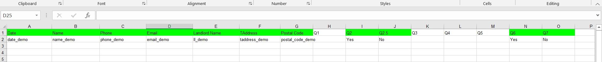
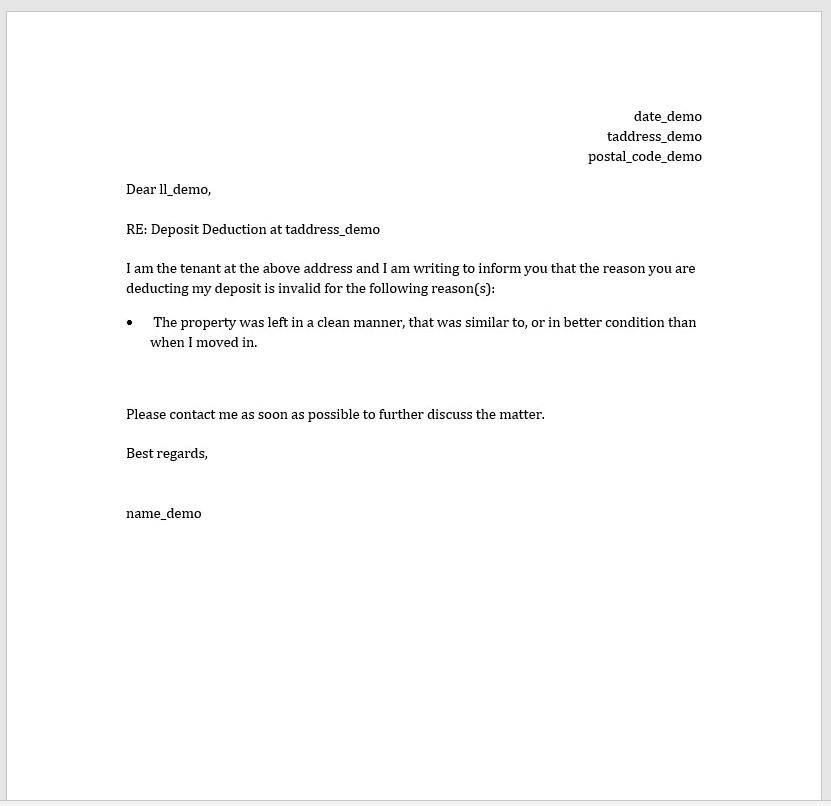
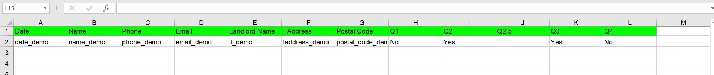
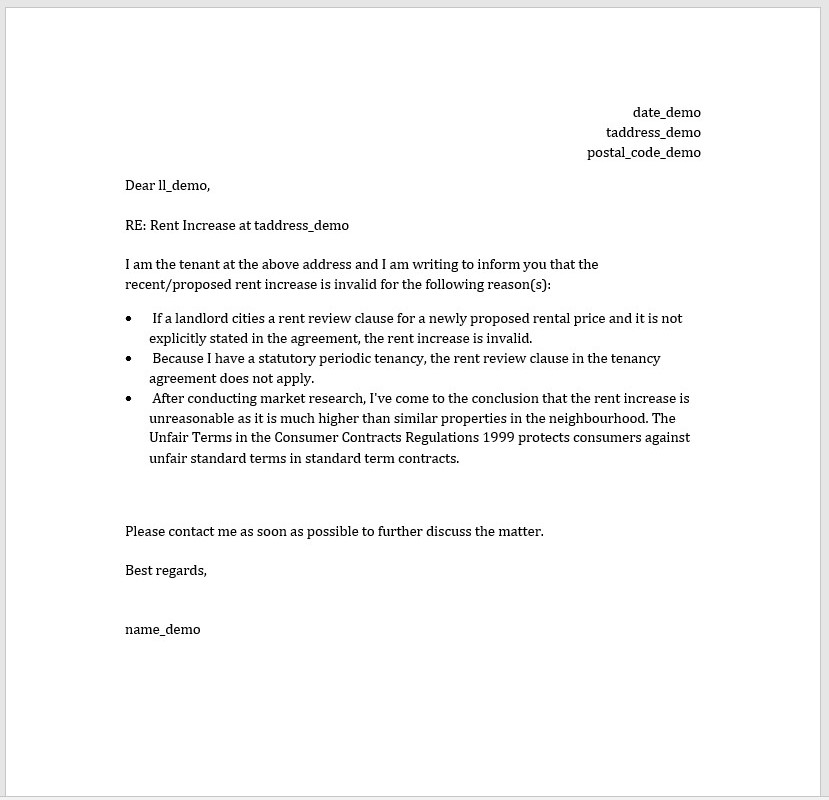
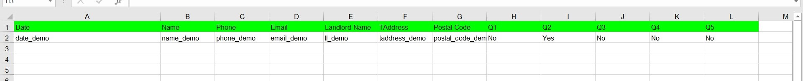
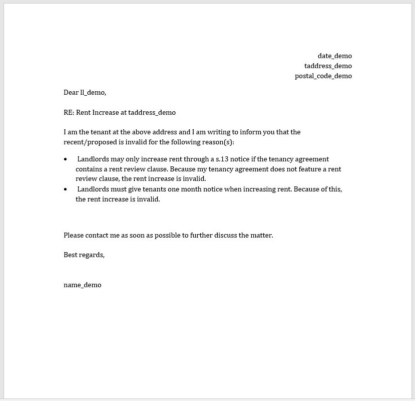

# work-19
Fiverr work on creating documents using Python


## Installation
1. Download and Install [Anaconda](https://www.anaconda.com/distribution/#download-section)
	> NOTE: Don't forget to tick the command terminal option (which is NOT recommended)
2. Install packages
```markdown
xlwings
python-docx
```

## Execution
* Run either [run.bat](./coding/run.bat) [for Windows] OR [run.sh](./coding/run.sh) [for any OS] file

<div style="page-break-after: always;"></div>

## 1. DocumentDeduction-Challenge
* Excel input
<p align="center">
  
</p>
* Word output
<p align="center">
  
</p>

<div style="page-break-after: always;"></div>

## 2. RentIncreaseChallenge-s.13
* Excel input
<p align="center">
  
</p>
* Word output
<p align="center">
  
</p>

<div style="page-break-after: always;"></div>

## 3. RentIncreaseChallenge-RentReview
* Excel input
<p align="center">
  
</p>
* Word output
<p align="center">
  
</p>


